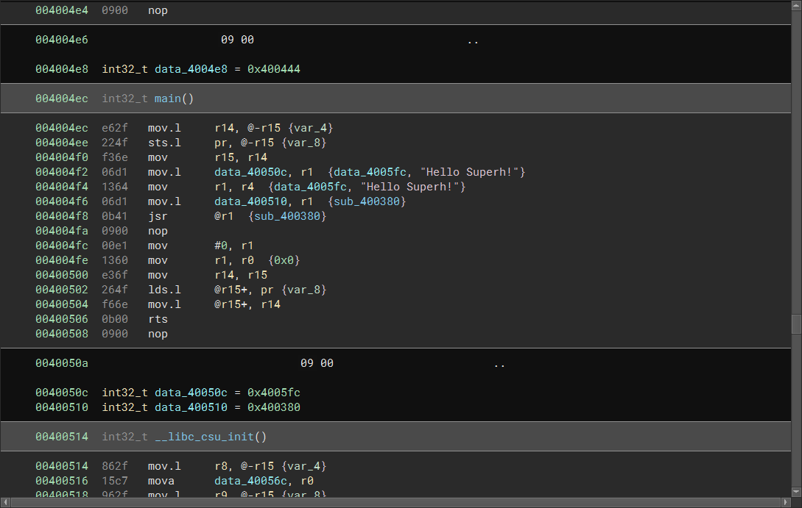

# SuperH Architecture Support for Binary Ninja

This plugin provides support for working with the [SuperH architecture](https://en.wikipedia.org/wiki/SuperH) in Binary Ninja.



## Install

To build from source, ensure that both [Rust](https://www.rust-lang.org/learn/get-started) and Binary Ninja are installed.

```none
git clone https://github.com/starfleetcadet75/binaryninja-superh.git
cd binaryninja-superh
cargo build --release
cp ./target/release/libarch_superh.so ~/.binaryninja/plugins
```

## Minimum Version

This plugin is currently built using the dev branch from the Binary Ninja API, therefore this plugin should work with the latest development version.

## Develop

Run `cargo fmt --all` and `cargo clippy --all` before submitting changes.

## References

- [Renesas SuperH Instruction Set Summary](http://shared-ptr.com/sh_insns.html)
- [SH Application Binary Interface for GCC](https://llvm-gcc-renesas.com/manuals/SH-ABI-Specification.html)
- [SuperH RISC Engine SH-1/SH-2 Programming Manual](https://antime.kapsi.fi/sega/files/h12p0.pdf)
- [SH-4 CPU Core Architecture](https://www.st.com/resource/en/user_manual/cd00147165-sh-4-32-bit-cpu-core-architecture-stmicroelectronics.pdf)
- [The SuperH-3](https://devblogs.microsoft.com/oldnewthing/20190805-00/?p=102749)
- [SH-4 generic and C specific application binary interface, includes DWARF and Reloc information](https://www.st.com/resource/en/reference_manual/CD17839242-.pdf)
- [Write-up "Dreamcast Japanese Imports" NSec 2020 Challenge](https://github.com/jglaurin/NSEC2020-Dreamcast)
- [NSEC 2020 - Dreamcast Writeup](https://blog.quantumlyconfused.com/reverse-engineering/2020/05/19/nsec2020-dreamcast/)

## License

This plugin is released under a [MIT license](LICENSE).
